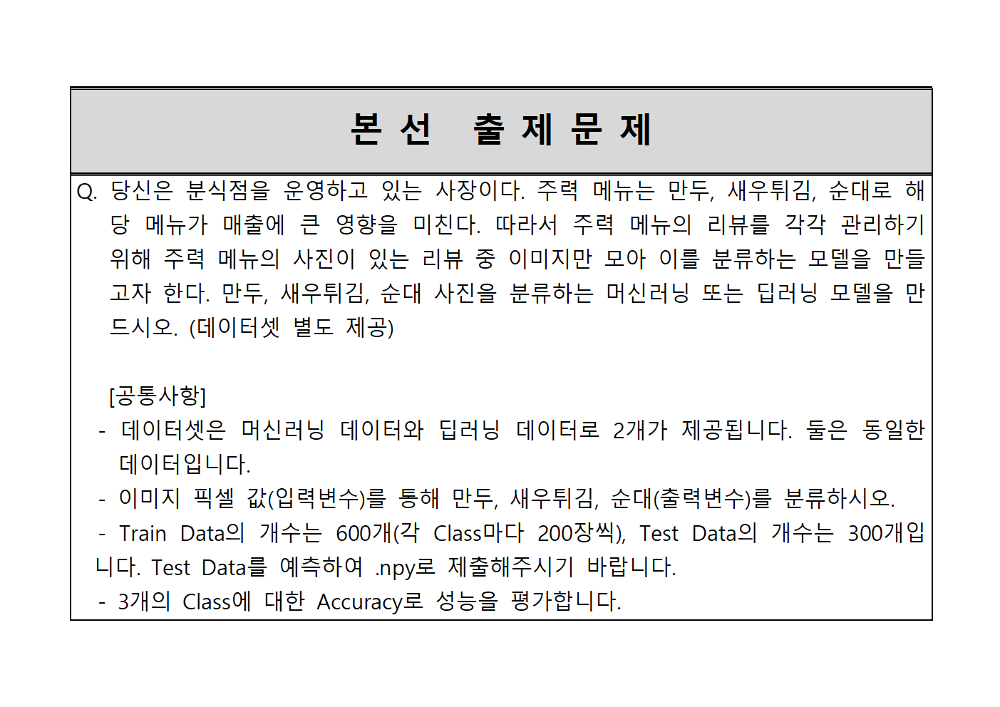
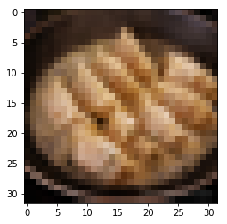
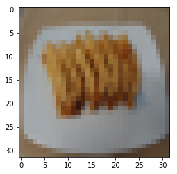
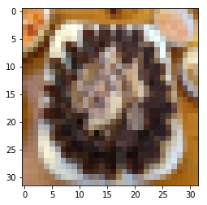
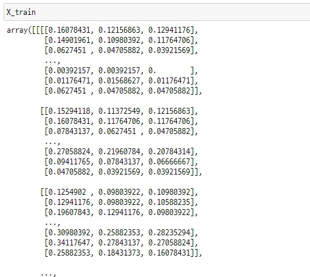
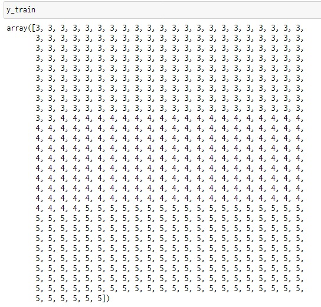

# 이미지 다중 분류 문제

## 목차
1. [문제 정의](#1-문제-정의)
2. [머신러닝](#2-머신러닝)
3. [딥러닝](#3-딥러닝)
4. [정리](#4-정리)

## 1. 문제 정의



리뷰 사진을 이용하여 만두, 새우튀김, 순대를 분류하는 문제입니다.  

머신러닝 데이터셋은 `pickle` 파일로 제공되었고,  
딥러닝 데이터셋은 `numpy` 파일로 제공되었습니다.  

## 2. 머신러닝

### 탐색적 자료분석

데이터의 특성을 알아보기 위해 탐색적 자료분석(EDA)를 했습니다.  

```python
필요한 패키지를 불러옵니다.
import pandas as pd
import numpy as np
import matplotlib.pyplot as plt
```

```python
train.shape, test.shape
train.head(5)
# 3072개의 픽셀과 label
```
> ((600,3073), (300, 3072))

| |0|1|...|3071|label|
|-|-|-|-|-|-|
|0|0.160784|0.121569|...|0.003922|3|
|1|0.964706|0.964706|...|0.952941|3|
|2|	0.564706|0.415686|...|0.411765|3|
|||||||

각 행은 각각의 이미지를 나타내며,    
총 600개의 이미지로 3072개의 픽셀과 label이 있습니다.  
3072개의 픽셀을 (32,32,3) 형태로 변환하면 이미지가 됩니다.  

이미지로 변환 후, 각 label의 음식을 확인해보았습니다.  

| 만두 | 새우튀김 | 순대 |
| --- | --- | --- |
|  |  |  |
| label 3 | label 4 | label 5 |
| 1~200번째 | 201~400번째 | 401~600번째 |

```python
from sklearn.model_selection import train_test_split
X_train, X_vld, y_train, y_vld = train_test_split(X, y, random_state=42, test_size = .2)
X_train.shape, X_vld.shape, y_train.shape, y_vld.shape
```
> ((480, 3072), (120, 3072), (480,), (120,))

600개의 이미지 중 480장으로 학습에 이용하였고,  
나머지 120장은 Validation으로 구성하여 성능을 검증하는데 이용했습니다.

### 모델링

분류 모델로 `로지스틱 회귀모델`과 `K-최근접 이웃(KNN) 모델`을 이용했습니다.  

KNN 모델의 특징은 비모수적 방법을 이용하며,  
높은 정확도를 가지지만 cost가 많이 든다는 단점이 있습니다.

```python
# 필요한 패키지를 불러옵니다.
from sklearn.linear_model import LogisticRegression
from sklearn.neighbors import KNeighborsClassifier
from sklearn.model_selection import GridSearchCV
from sklearn.metrics import accuracy_score, classification_report, confusion_matrix
```

```python
algorithmes = [LogisticRegression(), KNeighborsClassifier(n_jobs=-1)]

# 실험 파라미터 설정
params = []

# Logistic Regression 하이퍼 파라미터
params.append([{
    "solver" : ["saga"],
    "penalty" : ["l1"],
    "C" : [0.1,  5.0, 7.0, 10.0, 15.0, 20.0, 100.0]
    },{
    "solver" : ['liblinear'],
    "penalty" : ["l2"],
    "C" : [0.1,  5.0, 7.0, 10.0, 15.0, 20.0, 100.0]
    }
    ])

# KNN 하이퍼 파라미터
params.append({
    "p":[int(i) for i in range(1,3)],
    "n_neighbors":[i for i in range(2, 6)]})

# 5 - Fold Cross Validation & Accuracy
scoring = ['accuracy']
estimator_results = []
for i, (estimator, params) in enumerate(zip(algorithmes,params)):
    gs_estimator = GridSearchCV(
            refit="accuracy", estimator=estimator,param_grid=params, scoring=scoring, cv=5, verbose=1, n_jobs=4)
    print(gs_estimator)

    gs_estimator.fit(X, y)
    estimator_results.append(gs_estimator)
```

Grid Search 방법으로 모델의 하이퍼 파라미터를 찾고,  
5-Fold 교차 검증을 통해 가장 좋았던 파라미터를 찾았습니다.  

로지스틱 회귀모델의 가장 좋은 성능은 **0.7433** 이며, KNN 모델의 가장 좋은 성능은 **0.5983** 으로 나왔습니다.  
가장 성능이 좋은 로지스틱 회귀모델로 학습을 진행했습니다.  

```python
#가장 좋은 모델 설정
model = estimator_results[0].best_estimator_
model.fit(X_train, y_train)
```

이후 Validation set을 통해 모델의 성능을 검증하고  
분류결과 표를 그려보았습니다.  

```python
# validation 예측
pred = model.predict(X_vld)

# validation set 성능 확인
print(classification_report(y_vld, pred))
print(confusion_matrix(y_vld, pred))
```

||precision|recall|f1-score|support|
|-|-|-|-|-|
|3|0.74|0.53|0.62|43|
|4|0.73|0.97|0.83|36|
|5|0.71|0.71|0.71|41|
||||||
|**accuracy**|||||0.73|120|
|**macro avg**|0.73|0.74|0.72|120|
|**weighted avg**|0.73|0.72|0.71|120|

| 만두 | 새우튀김 | 순대 |
| --- | --- | --- |
| 23 | 8 | 12 |
| 1 | 35 | 0 |
| 7 | 5 | 29 |

Validation set을 검증한 결과, 로지스틱 회귀모델의 정확도는 **73%** 가 나왔습니다.  
Validation 120장을 추가하여 600장을 학습시킨 후, Test 데이터를 예측했습니다.

```python
# 전체데이터로 학습하기
model.fit(X, y)

# 테스트 데이터 복사
X_test = test.copy()
final_pred = model.predict(X_test)
```

## 3. 딥러닝

### 탐색적 자료분석

딥러닝의 데이터셋은 머신러닝과 동일하며, 데이터의 형태를 알아보았습니다.  

```python
X_train, y_train
X_train.shape, y_train.shape
```

   

> ((600, 32, 32, 3), (600, ))

각 class마다 200개씩 있으며 총 600장으로 이루어져 있습니다.  
이미지의 shpae은 (32, 32, 3)로 RGB 채널을 갖고있는 32x32 이미지 입니다.  

머신러닝과 동일하게 전체 이미지 중 480장을 학습에 이용하고,  
나머지 120장은 Validation으로 구성하여 성능 검증에 이용했습니다.  

```python
from sklearn.model_selection import train_test_split
X_train, X_vld, y_train, y_vld = train_test_split(X_train, y_train, random_state=42, test_size = .2)
X_train.shape, X_vld.shape, y_train.shape, y_vld.shape
```

### 모델링

```python
# 필요한 패키지를 불러옵니다.
from keras.models import Sequential
from keras.layers import Dense, Conv2D, MaxPooling2D, Dropout, Flatten
from keras.callbacks import ModelCheckpoint, EarlyStopping
from keras.utils import np_utils
```

```python
y_train = y_train-3
y_vld = y_vld-3
y_train = np_utils.to_categorical(y_train, 3)
y_vld= np_utils.to_categorical(y_vld, 3)

y_train
"""
array([0, 0, 1, ... ]) -> array([[1., 0., 0.],
                                 [1., 0., 0.],
                                 [0., 1., 0.], ...]])
"""
```

3, 4, 5로 되어있는 라벨을 0, 1, 2로 바꾸기 위해 3을 빼고 `One-hot encoding`을 했습니다.  
이미지의 특징을 찾기 위해 `CNN` 모델을 사용했습니다.  

```python
# CNN 구조
model = Sequential()
model.add(Conv2D(32, (3, 3), activation='relu', input_shape=(32, 32, 3)))
model.add(MaxPooling2D((2, 2)))
model.add(Conv2D(64, (3, 3), activation='relu'))
model.add(MaxPooling2D((2, 2)))
model.add(Conv2D(64, (3, 3), activation='relu'))
model.add(Flatten())
model.add(Dense(128, activation='relu'))
model.add(Dropout(0.5))
model.add(Dense(3, activation='softmax'))
model.compile(loss='categorical_crossentropy',
              optimizer='adam',
              metrics=['accuracy'])
model.summary()       
```

CNN 구조는 다음과 같습니다.  
input layer -> Conv1 -> Maxpool1 -> Conv2 -> Maxpool2 -> Conv3 -> flatten -> Dense1 -> ouput layer  
`기울기 소실(Vanishing gradient)` 현상을 해결하기 위해 활성 함수는 `Relu`를 이용했습니다.  

```python
# Early Stopping -> overfitting 방지
cb_early_stopping = EarlyStopping(monitor='val_loss', patience=10)

history = model.fit(X_train, y_train,
                    validation_data=(X_vld, y_vld),
                    epochs=100, batch_size=64, verbose=1,
                    callbacks=[cb_early_stopping])

print('\nAccuracy: {:.4f}'.format(model.evaluate(X_vld, y_vld)[1]))
```

과적합을 방지하기 위해 `Early Stopping`의 판정 기준 지표를 val_loss로 지정했습니다.  
10 epoch 연속으로 val_loss가 개선되지 않을 때 종료되도록 했습니다.  
그 결과 CNN 모델의 Accuracy는 **81%** 가 나왔습니다.  

이후 Validation set을 가지고 모델의 성능을 검증했습니다.  

```python
# validation 예측
pred = np.argmax(model.predict(X_vld), axis=-1)
pred += 3
y_vld = y_vld.argmax(axis = 1) + 3
```

pred에 3을 더해 다시 3, 4, 5로 바꾸었습니다.  
마찬가지로 y_vld.argmax(axis = 1)에 3을 더해 `One-hot encoding`을 원래 class로 바꾸었습니다.

```python
from sklearn.metrics import classification_report, confusion_matrix, accuracy_score
print(classification_report(y_vld, pred))
print(confusion_matrix(y_vld, pred))
```

||precision|recall|f1-score|support|
|-|-|-|-|-|
|3|0.79|0.72|0.76|43|
|4|0.78|1.00|0.88|36|
|5|0.89|0.76|0.82|41|
||||||
|**accuracy**|||||0.82|120|
|**macro avg**|0.82|0.83|0.82|120|
|**weighted avg**|0.82|0.82|0.81|120|

| 만두 | 새우튀김 | 순대 |
| --- | --- | --- |
| 31 | 8 | 4 |
| 0 | 36 | 0 |
| 8 | 2 | 31 |

Validation set을 검증한 결과, CNN 모델의 정확도는 **82%** 가 나왔습니다.  
이후 학습된 모델에 Validation 120장을 추가로 다시 학습시켜 `Fine Tuning`을 했습니다.  
이 모델을 최종 모델로 하여 Test 데이터를 예측했습니다.

```python
# one hot encoding
y_vld -= 3
y_vld= np_utils.to_categorical(y_vld, 3)
model.fit(X_vld, y_vld, epochs=10, batch_size=64, verbose=1)

final_pred = np.argmax(model.predict(X_test), axis=-1)
final_pred += 3
```

## 4. 정리

머신러닝과 딥러닝 모델의 성능을 비교한 결과,  
로지스틱 회귀모델의 성능은 0.73, CNN 모델의 성능은 0.81로 CNN 모델이 더 좋게 나왔습니다.  

음식점 리뷰 데이터를 분석하면서 이런 식으로 마케팅에 활용될 수 있다는 것을 배웠고,  
리뷰를 자동으로 수집/분석한 결과를 사장님에게 음식과 가게 운영에 대한 피드백을 제공해주고  
메뉴판이나 가게 전단지 등도 이미지를 자동으로 생성해주는 미래가 올 수도 있겠다라는 인사이트를 보았습니다.  
