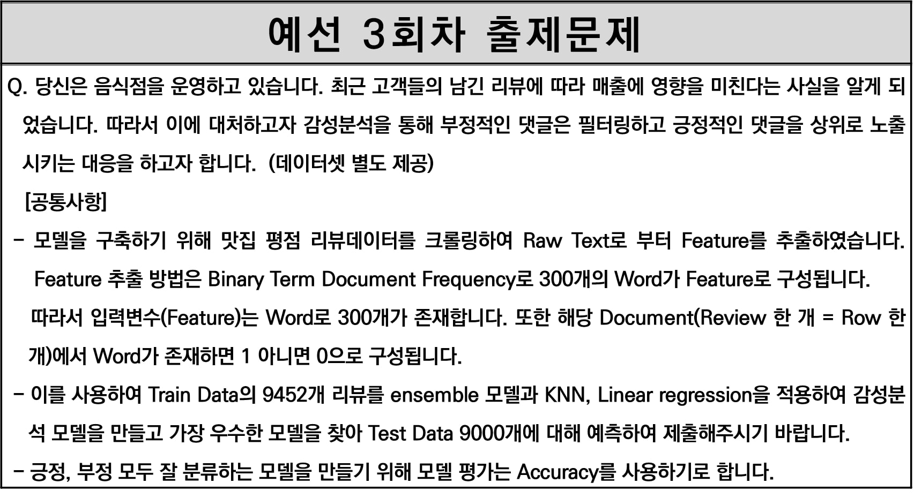
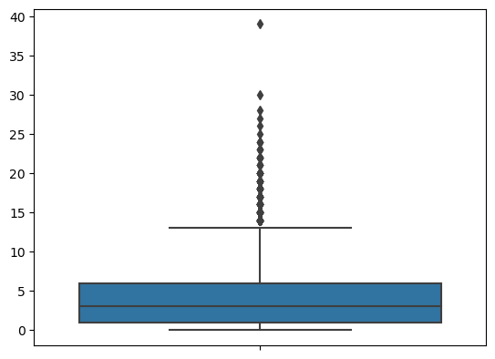

# 텍스트 감성 분석 문제

## 목차
1. [문제 정의](#1-문제-정의)
2. [탐색적 자료분석](#2-탐색적-자료분석)
3. [모델링](#3-모델링)
4. [정리](#4-정리)

## 1. 문제 정의



리뷰 글을 분석하여 긍정/부정을 분류하는 문제입니다.  


## 2. 탐색적 자료분석

### 탐색적 자료분석

데이터의 특성을 알아보기 위해 탐색적 자료분석(EDA)를 했습니다.  

```python
필요한 패키지를 불러옵니다.
import pandas as pd
import numpy as np
import matplotlib.pyplot as plt
import seaborn as sns
```

```python
total = train.append(test, ignore_index = True)
total.shape
```

|id|정말|너무|...|그럼|label|
|-|-|-|-|-|-|
|1|0|0|...|0|1|
||||||
|4|1|0|...|0|0|
||||||

> (18452, 302)

문제에 정의된대로 Train 데이터는 9452개, Test 데이터는 9000개이며,  
300개의 Word와 ID, label 변수를 포함해 총 302개의 열이 존재합니다.

```python
X = total.drop(columns = ['Id', 'label'])
np.unique(X)
```
> array([0, 1], dtype=int64)

ID와 label을 제외한 모든 Feature는 0과 1로 이루어진 `Binary` 데이터 입니다.  
각 행은 문서를 의미하며, 이 행렬을 `Binary Term Dcoumnet` 행렬이라고 합니다.  

문서가 몇 개의 Word를 가지고 있는지 파악하기 위해 박스플롯과 기술통계량을 구했습니다.

```python
# Document의 Token 갯수의 Distibution 확인
sns.boxplot(y = X.sum(axis = 1))

# Document의 Token 갯수의 요약통계량 확인
X.sum(axis = 1).describe()
```



| Statistics | Value|
| --- | --- |
| count | 18452 | 
| mean | 4.120 | 
| std | 3.583 | 
| min | 0.000 | 
| 25% | 1.000 | 
| 50% | 3.000 | 
| 75% | 6.000 | 
| max | 39.000 | 

어떤 문서는 최대 39개의 단어로 이루어져 있고,  
어떤 문서는 어떤 단어도 없이 평가만 한 글도 있었습니다.  
어떤 단어도 없는 경우는 분석할 수 없다고 판단했습니다.  

```python
# 가장 많이 등장한 Token 30개 확인
pd.DataFrame(X.sum(axis = 0)).sort_values(0, ascending=False).iloc[:30]
```

| Word | Freq |
| --- | --- |
| 정말 | 2316 | 
| 너무 | 2007 | 
| 진짜 | 1754 | 
| | | 

각 열은 단어를 뜻하며, 각 단어가 얼마나 나왔는지 내림차순으로 정렬하여 확인했습니다.  
다음은 긍정과 부정을 나눠보고 어떤 차이가 있는지 확인했습니다.  

```python
label0_X = total.query('label == 0').drop(columns = ['Id', 'label'])
label1_X = total.query('label == 1').drop(columns = ['Id', 'label'])

# 부정에서 가장 많이 등장한 Token 30개 확인
pd.DataFrame(label0_X.sum(axis = 0)).sort_values(0, ascending=False).iloc[:30]
# 긍정에서 가장 많이 등장한 Token 30개 확인
pd.DataFrame(label1_X.sum(axis = 0)).sort_values(0, ascending=False).iloc[:30]
```

| 부정 | Freq | | 긍정 | Freq |
| --- | --- | --- | --- | --- |
| 진짜 | 475 | | 정말 | 718 |
| 정말 | 469 | | 너무 | 645 |
| 너무 | 376 | | 맛있어요 | 604 |
| 그냥 | 335 | | 진짜 | 453 |
||||||

부정에서는 "그냥" 이라는 부정적인 단어가,  
긍정에서는 "맛있어요" 라는 긍정적인 단어가 나온 것을 확인할 수 있었습니다.  
동시에 긍정/부정 관계없이 공통적으로 많이 나온 단어들도 있음을 확인했습니다.  

```python
train['label'].value_counts()
train['label'].value_counts('percentage')
```
> 1 5402  0.5715  
> 0 4050  0.4284  

긍정과 부정의 비율을 확인해본 결과,  
긍정은 5402개로 전체 57.1%를 차지했으며,  
부정은 4050개로 전체 42.8%를 차지했습니다.  

## 3. 모델링

분류 모델로 `로지스틱 회귀모델`과 `K-최근접 이웃(KNN) 모델`을 이용했습니다.  

```python
# 필요한 패키지를 불러옵니다.
from sklearn.linear_model import LogisticRegression
from sklearn.neighbors import KNeighborsClassifier
from sklearn.model_selection import GridSearchCV
from sklearn.metrics import accuracy_score, classification_report, confusion_matrix
```

```python
algorithmes = [LogisticRegression(), KNeighborsClassifier(n_jobs=-1)]

# 실험 파라미터 설정
params = []

# Logistic Regression 하이퍼 파라미터
params.append([{
    "solver" : ["saga"],
    "penalty" : ["l1"],
    "C" : [0.1,  5.0, 7.0, 10.0, 15.0, 20.0, 100.0]
    },{
    "solver" : ['liblinear'],
    "penalty" : ["l2"],
    "C" : [0.1,  5.0, 7.0, 10.0, 15.0, 20.0, 100.0]
    }
    ])

# KNN 하이퍼 파라미터
params.append({
    "p":[int(i) for i in range(1,3)],
    "n_neighbors":[i for i in range(2, 6)]})

# 5 - Fold Cross Validation & Accuracy
scoring = ['accuracy']
estimator_results = []
for i, (estimator, params) in enumerate(zip(algorithmes,params)):
    gs_estimator = GridSearchCV(
            refit="accuracy", estimator=estimator,param_grid=params, scoring=scoring, cv=5, verbose=1, n_jobs=4)
    print(gs_estimator)

    gs_estimator.fit(X, y)
    estimator_results.append(gs_estimator)
```

Grid Search 방법으로 모델의 하이퍼 파라미터를 찾고,  
5-Fold 교차 검증을 통해 가장 좋았던 파라미터를 찾았습니다.  

```python
estimator_results[0].best_score_, estimator_results[1].best_score_
```

검정 결과,  
로지스틱 회귀모델의 가장 좋은 성능은 **0.7896** 이며, KNN 모델의 가장 좋은 성능은 **0.6977** 로 나왔습니다.  
가장 성능이 좋은 로지스틱 회귀모델로 학습을 진행했습니다.  

```python
# Logistic를 통한 가장 좋은 Feature 확인
feature_name = X.columns.to_numpy()
feature_name[estimator_results[0].best_estimator_.coef_.argsort()[::-1]]
```
> array([['다신','다시는','불친절',...,','맛있고','맛있어요']], dtype=object)

Coefficient를 내림차순 후 각각의 Feature를 확인했습니다.  
부정적인 단어들이 크고, 긍정적인 단어들은 반대로 작은 것을 확인할 수 있었습니다.  

```python
#가장 좋은 모델 설정
final_model = estimator_results[0].best_estimator_
final_model.fit(X, y)
X_test = test.drop(columns='Id')
y_pred = final_model.predict(X_test)
```
가장 좋은 모델과 하이퍼 파라미터로 Train 셋을 학습시킨 후 Test 셋을 예측했습니다.  

## 4. 정리

우리들이 일상 속에서 쓰는 리뷰들도 데이터화가 되어 이렇게 분석될 수 있다는 것을 배웠고,  
데이터를 보는 안목을 기른다면 분석을 통해 인사이트를 발굴하고 마케팅 활용 등 수익을 창출할 수 있겠다라는 생각이 들었습니다.
