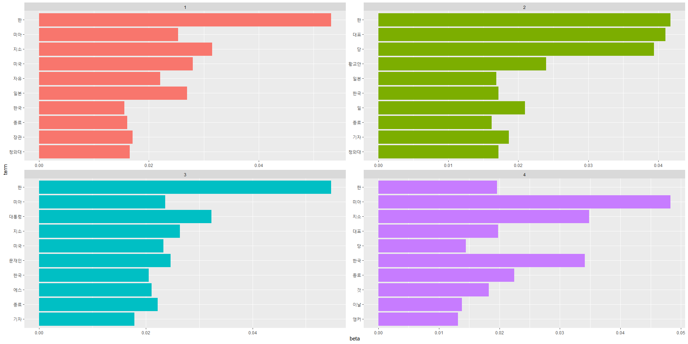

# 뉴스 빅데이터 분석


데이터 저널리즘이라는 새로운 시각을 배우고  
정재관 교수님과 배여운 기자님으로부터  
`R`을 활용한 뉴스 빅데이터 전처리 및 시각화 기법을 배웠습니다.

## 목차

1. [카테고리 분류](#1-기사-카테고리-분류)
2. [네트워크 분석](#2-네트워크-분석)

### 1. 기사 카테고리 분류

```R
# 필요한 패키지를 불러옵니다.
library(readxl)
library(dplyr)
library(stringr)
library(lubridate)
library(tidyr)
library(tidygraph) # 데이터프레임을 그래프로
library(ggraph) # 네트워크 분석 시각화
```

```R
# 수집한 기사 데이터를 불러옵니다.
data <- read_excel("sample.xlsx")
head(data)
```

|뉴스 식별자|일자|언론사|기고자|제목|통합 분류1|...|URL|분석제외 여부|
|-|-|-|-|-|-|-|-|-|
|011..|20191121|한겨례|박민희|"미 한반도.."|국제>국제일반|...|http..||
|081..|20191121|YTN|김상우|"日, NSC 개최.."|정치>외교|...|https..||
|||||||...|||
|081..|20191121|KBS|이세연|"여야,.."|정치>국회_정당|...|http..|중복||

수집한 기사 데이터는 위와 같습니다.  
변수는 아래 16개와	본문, URL, 분석제외 여부까지 총 19개의 변수가 있습니다.  
변수명이 한글일 경우, 오류가 날 수 있어 영어로 변환했습니다.  

```R
# 기사의 정보가 있는 16개의 변인 가져오기
info <- data %>% select(1:16)
info <- info %>% 
  rename(
    id = `뉴스 식별자`,
    date = '일자',
    company = '언론사',
    author = '기고자',
    title = '제목',
    category1 = `통합 분류1`,
    category2 = `통합 분류2`,
    category3 = `통합 분류3`,
    event1 = `사건/사고 분류1`,
    event2 = `사건/사고 분류2`,
    event3 = `사건/사고 분류3`, 
    player = '인물',
    location = '위치', 
    organization = '기관',
    keyword = '키워드',
    feature = '특성추출'
  )
```

날짜 등을 분석할 수 있도록 변환 후,  
몇 개의 언론사가 포함되어 있는지 확인했습니다.  

```R
table(info$company)

info %>% 
  count(company) %>% 
  arrange(desc(n))
```

| company | n |
| --- | --- |
| YTN | 199 |
| 세계일보 | 118 |
| 중앙일보 | 93 |
|||

총 43개의 언론사가 있었으며, 가장 많이 수집된 언론사는 YTN으로 199개가 나왔습니다.  
이후 기사의 카테고리를 확인했습니다.  

```R
# 카테고리 정보 확인
category <- info$category1
str_split(category, pattern=">")

# 카테고리 정보 나누기
info %>% 
  separate(category1, c("ct1","ct2"),
           sep=">",remove=F,extra="merge",fill="right") %>% 
  select(category1,ct1,ct2)
```

|category1|ct1|ct2|
|-|-|-|
|국제>국제일반|국제|국제일반|
|정치>외교|정치|외교|
|정치>국회_정당|정당|국회_정당|
||||

기사의 카테고리를 세분화하여 나누었고, 그 중 "국회_정당"을 한번 더 나누었습니다.

```R
# 정치>국회_정당 하위 분류
info %>% 
  separate(category1, c("ct1","ct2"),
           sep=">",remove=F,extra="merge",fill="right") %>% 
  separate(ct1, c("ct1a","ct1b"),
           sep="_",remove=F,extra="merge",fill="right") %>% 
  separate(ct2, c("ct2a","ct2b"),
           sep="_",remove=F,extra="merge",fill="right") %>% 
  select(category1,starts_with("ct")) 

firstct <- info %>% 
  separate(category1, c("ct1","ct2"),
           sep=">",remove=F,extra="merge",fill="left") %>% 
  separate(ct1, c("ct1a","ct1b"),sep="_",remove=F,extra="merge",fill="left") %>% 
  separate(ct2, c("ct2a","ct2b"),sep="_",remove=F,extra="merge",fill="left") %>% 
  select(ct1a, ct1b, ct2a,ct2b) 

table(c(firstct$ct1a,firstct$ct1b,firstct$ct2a,firstct$ct2b))  
```

### 2. 네트워크 분석

인물이 나오면 네트워크 분석을 할 수 있습니다.  
인물(player) 변수는 다음과 같습니다.  

|뉴스 식별자|...| 인물(player) |
|-|-|-|
|011..|...| 서주석,니시노,... | 
|081..|...| 스가 요시히데 | 
|021..|...|윌터 샤프, 제임스 서먼,...|

```R
# 각각의 인물을 쪼개기
node <- info %>% 
  separate(player, c("name1","name2","name3","name4","name5","name6","name7","name8","name9","name10"),
           sep=",",remove=F,extra="merge",fill="right") %>% 
  select(starts_with("name"))
```

`ggraph`는 네트워크 시각화에서 주로 쓰이는 함수입니다.  
node와 edge를 구성하고 있습니다.  
(node: 행위자 / edge: 연결 -> 행위자와 행위자 사이를 연결)

```R
network <-as_tbl_graph(node)
plot(network)
network

ggraph(network) + geom_node_point() + geom_edge_link()
# 기본 레이아웃은 stress이며, graphopt, grid 등 다양하게 있습니다.
network %>% 
  as_tbl_graph() %>% 
  ggraph(layout='graphopt') + geom_node_text(aes(label=name)) + geom_edge_link(aes(start_cap = label_rect(node1.name), end_cap = label_rect(node2.name)))
```


매개 중심성을 계산하면 누가 누구와 많이 연결되었는지 알 수 있습니다.  

```R
network %>% 
  as_tbl_graph() %>% 
  mutate(cor= centrality_betweenness()) %>% 
  as_tibble %>% 
  arrange(desc(cor))
```

### LDA

`LDA`는 문서의 집합으로부터 어떤 토픽이 존재하는지를 알아내기 위한 알고리즘입니다.

```R
# 필요한 패키지를 불러옵니다.
library(readxl)
library(dplyr) # 파이프 함수를 이용하여 변인 선택
```

```R
# 저장된 엑셀데이터 불러오기 
data <- read_excel("sample.xlsx")
head(data)

# 마지막 2개 변수 제외 모두 
tempdata <- data %>% select(1:17)

# 변수명을 바꾸기 
tempdata <- tempdata %>% 
  rename(
    newid = `뉴스 식별자`,
    day=일자,
    comp=언론사,
    author=기고자,
    title=제목,
    cate_all_1=`통합 분류1`,
    cate_all_2=`통합 분류2`,
    cate_all_3=`통합 분류3`,
    cate_event_1=`사건/사고 분류1`,
    cate_event_2=`사건/사고 분류2`,
    cate_event_3=`사건/사고 분류3`, 
    agent=인물,
    location=위치, 
    organ=기관,
    keyword=키워드,
    feature=특성추출,
    contents=본문
  )

# tempdata에서 콘텐츠(본문) 부분만 따오기
contents <- tempdata$contents
head(contents)
```

```R
#한국어 텍스트분석을 위한 패키지
library(KoNLP)

# 데이터에서 명사만 추출하고자 함. 시스템 디폴트 사전을 사용해도 되나 좀더 정확한 분석을 위해 
# 국립국어원에서 배포하는 사전과 정보화진흥원에서 배포하는 사전을 추가로 설치
useSejongDic()
useNIADic()

# 때로는 이 사전에 추가되지 않은 신조어를 처리해야 할 때가 있습니다.
# 이 때는 mergeUserDic이라는 명령어를 써서 추가합니다.
mergeUserDic(data.frame(c("개깜놀","핵존맛","JMT"), c("ncn")))

# 명사를 추출
txt <- extractNoun (contents)
head(txt)

# 우리가 원하지 않는 요소들을 추출해 내야 합니다
# 추출 함수는 크게 세 가지가 있으며 첫번째로 gsub을 사용하겠습니다.
# gsub은 문자열의 특정 부분을 지정하여 변환하는 기능을 수행. 오피스의 CTRL + H와 같음

# 불용어처리
#제어문자 삭제
txt_data <- gsub("[[:cntrl:]]","",txt)
#특수기호 삭제
txt_data <- gsub("[[:punct:]]","",txt_data)
#숫자 삭제
txt_data <- gsub("[[:digit:]]","",txt_data)
#소문자 삭제
txt_data <- gsub("[[:lower:]]","",txt_data)
#대문자 삭제
txt_data <- gsub("[[:upper:]]","",txt_data)
#특수문자 삭제
txt_data <- gsub("[^[:print:]]","",txt_data)

# 기호 삭제
txt_data <- gsub("▲","",txt_data)
txt_data <- gsub("◎","",txt_data)

head(txt_data)
```

```R
# 텍스트마이닝 패키지
library(tm)

docs <- Corpus(VectorSource(txt_data))
dtm <- DocumentTermMatrix(docs, control = list(removeNumbers = T,
                                               wordLength=c(2,Inf)
                                               ))
dtma <- removeSparseTerms(dtm, as.numeric(0.98))
inspect(dtma)
```

```R
raw.sum <- apply(dtma,1,FUN=sum)
dtma=dtma[raw.sum!=0,]

library(topicmodels)
# 전체 LDA
lda.out <-LDA(dtma,control = list(seed=100),k=4)

#문서, 토픽
dim(lda.out@gamma)
#토픽, 단어
dim(lda.out@beta)
#상위 10개
top.words <- terms(lda.out, 30)
top.words
```

```R
# 필요한 패키지를 불러옵니다.
library(tidytext)
library(ggplot2)
library(dplyr)
```

```R
terms <- tidy(lda.out, matrix = "beta")
terms

topterms <- terms %>%
  group_by(topic) %>%
  top_n(10, beta) %>%
  ungroup() %>%
  arrange(topic, -beta)

topterms %>%
  mutate(term = reorder(term, beta)) %>%
  ggplot(aes(term, beta, fill = factor(topic))) +
  geom_col(show.legend = FALSE) +
  facet_wrap(~ topic, scales = "free") +
  coord_flip()
```

```R
library(tidyr)

spread <- topterms %>%
  mutate(topic = paste0("topic", topic)) %>%
  spread(topic, beta) %>%
  filter(topic1 > .001 | topic2 > .001) %>%
  mutate(log_ratio = log2(topic2 / topic1))

spread
```


