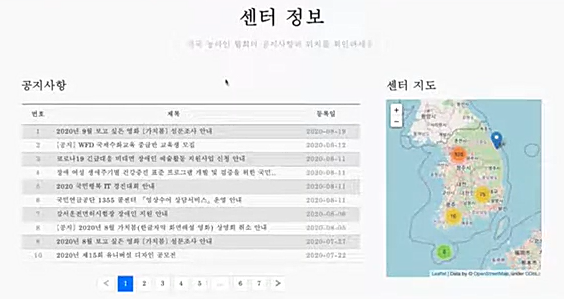
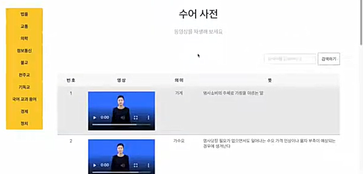
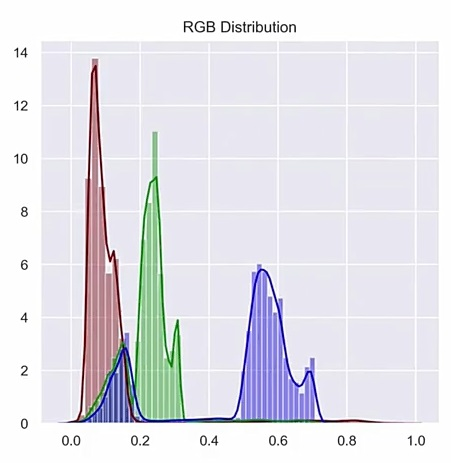
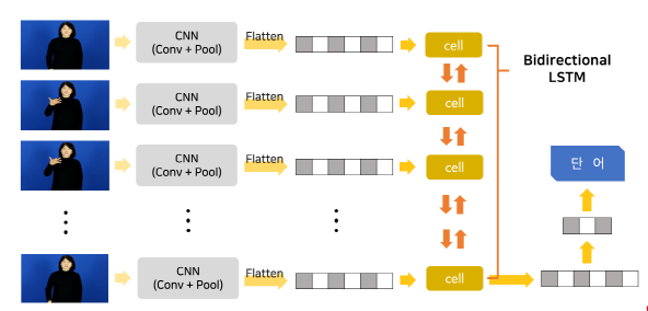
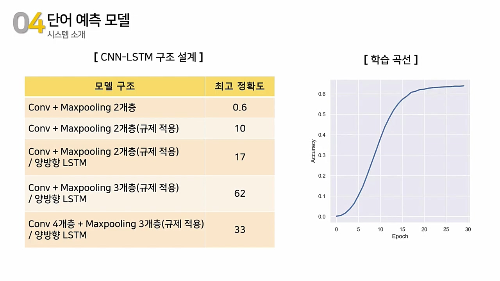

## 분석 프로젝트 코드

## 목차

1. [IPO(기업공개) 수 예측 분석](#1-ipo-수-예측-분석)
2. [농아인을 위한 수어 번역기 개발](#2-농아인을-위한-수어-번역기-개발)

## 1. IPO 수 예측 분석

모델에 대한 구체적인 내용은 
https://github.com/YUSEONGMIN/Papers-with-code/tree/main/CSAM

```python
# 필요한 패키지를 불러옵니다.
import numpy as np
import pandas as pd
import statsmodels.api as sm
import matplotlib.pyplot as plt
from statsmodels.tsa.stattools import adfuller
from scipy.stats import skew, kurtosis
```

$$ \alpha_i \circ X = \sum_{j=1}^{X} N_j, \quad N_j \sim Poi(\alpha_i) $$

> $\circ$: Poisson Thinning 연산자  
$\alpha_i$: 0과 1 사이의 실수값  
$X$: 음이 아닌 정수값

```python
# Poisson Thinning 연산자 함수를 생성합니다.
def PT(alpha,X):
    N=np.random.poisson(alpha,X)
    Y=sum(N)
    return Y
```

$$
\begin{align*}
&X_t = \alpha_1 \circ X_{t-1}^{(1)} + \alpha_2 \circ X_{t-1}^{(2)} + \cdots + \alpha_p \circ X_{t-1}^{(p)} + \varepsilon_t, \varepsilon_t \sim Poi(\lambda)\\
&X_{t-1}^{(i)} = \frac{1}{h_i}(X_{t-1} + \cdots + X_{t-h_i})
\end{align*}
$$

> $X_t \sim$ INHAR($p$) 모델  
$X_{t-1}^{(i)}$: $h_i$의 이동평균  
$h_i$: 음이 아닌 정수값 ($1\< h_1\< ...\< h_i\< ...\< h_p$)

``` python
"""
 Args:
 hps : [h_1, h_2, ..., h_p]
 params : [alpha_1, alpha_2, ..., alpha_p, lambda]
"""

def INHAR_P(hps,params,n):
    X0=list(np.random.poisson(params[-1],hps[-1])) # 초기 값 생성
    for t in range(hps[-1],n):
        order,Y=[],[]
        for i in hps:
            globals()['Xt_{}'.format(i)] = int(np.mean(X0[t-i:t])) # X_{t-1}^{(i)} 생성
            order.append(globals()['Xt_{}'.format(i)])
        for i in range(len(hps)):
            Xt=PT(params[i],order[i]) # alpha와 h_i 이동평균으로 PT 연산자 계산
            Y.append(Xt)
        lamb=np.random.poisson(params[-1]) # 파라미터 lambda를 가진 오차항 생성
        Y=sum(Y)+lamb
        X0.append(Y)
    return X0
```

파라미터 추정 방법은 **조건부 최소제곱법**(Conditional Least Squares; CLS)을 이용했습니다.

$$
\begin{equation}
\hat \theta_{CLS} =( \hat \alpha_{1,CLS}, \dots, \hat \alpha_{p,CLS}, \,\hat \lambda _{CLS})^{\top} = \mathbb{A}^{-1}\mathbb{b}
\end{equation}
$$

$$
\mathbb{b}= \left(\sum^n_{t=1}X_t X_{t-1}^{(1)}, \dots,  \sum^n_{t=1}X_t X_{t-1}^{(p)}, \sum^n_{t=1}X_t  \right)^{\top}
$$

$$
\mathbb{A}=  \left[
\begin{array}{lllll}
\sum\limits_{t=1}(X_{t-1}^{(1)})^2 & \sum\limits_{t=1}X_{t-1}^{(2)}X_{t-1}^{(1)} & \cdots & \sum\limits_{t=1}X_{t-1}^{(p)}X_{t-1}^{(1)} & \sum\limits_{t=1}X_{t-1}^{(1)} \\
\sum\limits_{t=1}X_{t-1}^{(1)}X_{t-1}^{(2)} & \sum\limits_{t=1}(X_{t-1}^{(2)})^2 & \cdots & \sum\limits_{t=1}X_{t-1}^{(p)}X_{t-1}^{(2)} & \sum\limits_{t=1}X_{t-1}^{(2)} \\
\vdots && \ddots && \vdots \\ 
\sum\limits_{t=1}X_{t-1}^{(1)}X_{t-1}^{(p)} & \sum\limits_{t=1}X_{t-1}^{(2)}X_{t-1}^{(p)} & \cdots & \sum\limits_{t=1}(X_{t-1}^{(p)})^2 & \sum\limits_{t=1}X_{t-1}^{(p)} \\
\sum\limits_{t=1}X_{t-1}^{(1)} & \sum\limits_{t=1}X_{t-1}^{(2)} & \cdots & \sum\limits_{t=1}X_{t-1}^{(p)} & n \\
\end{array}
\right]
$$

```python
def CLSE(data,hps): # CLS Estimator
    nn,p=len(data),len(hps)
    for i in range(p+1):
        globals()['b_'+str(i)] = 0 # b 초기값 생성
    A=np.zeros((p+1,p+1)) # A 초기값 행렬 생성
    for t in range(nn-hps[-1]):
        Xt=data[t+hps[-1]] # X_t
        Xtt=[] # X_{t-1}^{(i)}
        for i in hps:
            globals()['Xt_'+str(i)] = int(np.mean(data[t+hps[-1]-i : t+hps[-1]]))
            Xtt.append(globals()['Xt_'+str(i)])
        Xtt.append(1) # [X_{t-1}^{(1)},...,X_{t-1}^{(p)},1]
        for i in range(p+1):
            globals()['b_'+str(i)] = globals()['b_'+str(i)] + Xt*Xtt[i] # sum: X_t*X_{t-1}^{(1)}, ..., X_t*1
            for j in range(p+1):
                A[i,j]=A[i,j]+Xtt[i]*Xtt[j]
    b=[]
    for i in range(p+1):
        b.append(globals()['b_'+str(i)])
    A_inv=np.linalg.inv(A)
    return np.matmul(A_inv,b) # A^{-1}*b
```


INHAR($p$) 모형은 AR($h_p$) 모형의 변형으로 볼 수 있습니다.  
이 이론을 이용하여 **Yule-Walker 추정법**으로도 파라미터를 추정할 수 있습니다.

$$
E[X_t|{\cal{F_{t-1}}}] = Y_t \\
Y_t = \alpha_1 Y_{t-1}^{(1)}+\cdots+\alpha_p Y_{t-1}^{(p)}\\
Y_t = \beta_1 Y_{t-1}+\cdots+\beta_{h_p}Y_{t-h_p}
$$

$$
\hat\alpha_{i,YW}=h_i(\frac{\sum\limits_{j=h_{i-1}+1}^{h_i}\hat\beta_{j,YW}}{h_i-h_{i-1}}-\sum_{l=i+1}^{p}\frac{\hat\alpha_{l,YW}}{h_l}), h_0=0
$$

```python
def YWE(data,hps): # Yule-Walker Estimator
    his=[0,*hps]
    beta=sm.regression.linear_model.yule_walker(data,his[-1],"mle")[0] # beta 계산
    a_h,ayw=0,[] # sum: alpha_l/h_l 초기값 0 
    for i in reversed(range(1,len(his))):
        globals()['a_'+str(i)] = his[i]*(sum(beta[his[i-1]:his[i]])/(his[i]-his[i-1])-a_h)
        a_h = a_h + globals()['a_'+str(i)]/his[i]
        ayw.append(globals()['a_'+str(i)])
    ayw.reverse()
    X,Y=INHAR(data,hps)
    lamb=np.mean([Y[t]-sum(np.array(ayw)*X[t][:len(hps)]) for t in range(len(Y))])
    return np.array([*ayw,lamb])
```

### 데이터 분석

이질적 특성을 반영한 모형이므로 이질적 시장가설을 따르는 금융 데이터를 선택했습니다.
> 참고문헌  
[Muller, U. A. et al. (1993), Fractals and Intrinsic Time - a Challenge to Econometricians, OA.](https://EconPapers.repec.org/RePEc:wop:olaswp:_009)  
[Ivanov V and Lewis CM (2008). The determinants of market-wide issue cycles for initial public offerings, JCF, 14, 567–583.](https://doi.org/10.1016/j.jcorpfin.2008.09.009)  
[Gucbilmez, U. (2015). IPO waves in China and Hong Kong, IRFA, 40, 14–26.](https://doi.org/10.1016/j.irfa.2015.05.010)  

### EDA

데이터 출처: 국내 기업공시채널 [KIND(Korea investor’s network for disclosure system)](https://kind.krx.co.kr)

2000.01 ~ 2022.07 동안의 월별 국내 기업공개(Initial public offering; IPO) 수를 분석했습니다.  
최근 5년의 IPO 데이터의 다음과 같습니다.

|년/월|1|2|3|4|5|6|7|8|9|10|11|12|
|--|--|--|--|--|--|--|--|--|--|--|--|--|
|2022|4|13|8|7|3|10|7|0|0|0|0|0|
|2021|6|11|10|6|9|6|4|8|10|11|11|8|
|2020|2|4|7|0|2|6|15|9|11|6|6|18|
|2019|2|3|7|1|8|6|10|12|5|12|14|17|
|2018|2|8|3|2|4|4|6|9|5|7|18|22|


IPO 데이터의 정상성을 확인하기 위해 기술통계량 및 ADF-검정을 수행했습니다. 

|n|mean|med|max|min|std|skew|kurto|ADF statistic|ADF p-value|
|--|--|--|--|--|--|--|--|:-:|:-:|
271|6.830|6.000|39.000|0.000|6.104|1.985|5.408|−2.914|0.044|

```python
pd.DataFrame(ipo).describe()
skew(ipo), kurtosis(ipo, fisher=True)
adfuller(ipo)
```
 
검정 결과 유의확률(p-value) 값이 0.05보다 작으므로 정상성임을 확인할 수 있습니다.

### Fitting

월별 데이터임을 고려하여 
하이퍼 파라미터 $h_p$는 12개월 (1,12)과 6개월 (1,6,12)로 선택했습니다.

```python
hps=[1,6,12]
X,Y=INHAR(ipo,hps)
model=sm.OLS(Y,X)
results=model.fit()
results.params
CLSE(ipo,hps), YWE(ipo,hps)
```

<table class="tg">
<thead>
  <tr>
    <th class="tg-baqh"></th>
    <th class="tg-baqh" colspan="2">CLS</th>
    <th class="tg-baqh"></th>
    <th class="tg-baqh" colspan="2">YW</th>
  </tr>
</thead>
<tbody>
  <tr>
    <td class="tg-baqh">INHAR(3)</td>
    <td class="tg-baqh">coef.</td>
    <td class="tg-baqh">(s.e.)</td>
    <td class="tg-baqh"></td>
    <td class="tg-baqh">coef.</td>
    <td class="tg-baqh">(s.e.)</td>
  </tr>
  <tr>
    <td class="tg-baqh">$\alpha_1$</td>
    <td class="tg-baqh">0.3069</td>
    <td class="tg-baqh">(0.0667)</td>
    <td class="tg-baqh"></td>
    <td class="tg-baqh">0.3025</td>
    <td class="tg-baqh">(0.0668)</td>
  </tr>
  <tr>
    <td class="tg-baqh">$\alpha_2$</td>
    <td class="tg-baqh">0.1141</td>
    <td class="tg-baqh">(0.1840)</td>
    <td class="tg-baqh"></td>
    <td class="tg-baqh">0.1981</td>
    <td class="tg-baqh">(0.1843)</td>
  </tr>
  <tr>
    <td class="tg-baqh">$\alpha_3$</td>
    <td class="tg-baqh">0.3442</td>
    <td class="tg-baqh">(0.1862)</td>
    <td class="tg-baqh"></td>
    <td class="tg-baqh">0.3404</td>
    <td class="tg-baqh">(0.1865)</td>
  </tr>
  <tr>
    <td class="tg-baqh">$\lambda$</td>
    <td class="tg-baqh">1.6411</td>
    <td class="tg-baqh">(0.6564)</td>
    <td class="tg-baqh"></td>
    <td class="tg-baqh">1.1782</td>
    <td class="tg-baqh">(0.6575)</td>
  </tr>
</tbody>
</table>

IPO 데이터의 CLS 추정량과 Yule-Walker 추정량을 계산하고 INHAR 모형에 적합(fitting) 시켰습니다.  
아래는 CLS 추정량을 통해 적합한 모습입니다.


### Forecasting

> In-sample: 2000.01 - 2020.12 기간의 252개 데이터  
 Out-of-sample: 2021.01 - 2022.07 기간의 19개 데이터

추정된 파라미터를 통해 예측 값을 구하고 기존의 INAR 모형과 예측 성능을 비교해보았습니다.  
95% 신뢰구간 하에 예측 그래프는 다음과 같습니다.


```python
def INHAR_FORE(data,hps,m,n,method):
    if method=="CLS":
        F,F_cl,F_cu=[],[],[]
        for i in range(n):
            X,Y=INHAR(data[-m+i:-n+i],hps)
            model=sm.OLS(Y,X)
            results=model.fit()
            clse=results.params
            clse_cl=np.array([results.conf_int()[_][0] for _ in range(len(hps)+1)])
            clse_cu=np.array([results.conf_int()[_][1] for _ in range(len(hps)+1)])
            y,y_cl,y_cu=sum(clse*X[-1]),sum(clse_cl*X[-1]),sum(clse_cu*X[-1])
            F.append(y)
            F_cl.append(y_cl)
            F_cu.append(y_cu)
        res=np.array(F)-data[-n:]
        F_cls=[F,F_cl,F_cu]
        return res,F_cls
    
    elif method=="YW":
        F_yw=[]
        for i in range(n):
            ywe=YWE(data[-m+i:-n+i],hps)
            X,Y=INHAR(data[-m+i:-n+i],hps)
            y=sum(ywe*X[-1])
            F_yw.append(y)
        res=np.array(F_yw)-data[-n:]
        return res,F_yw  
    else:
        raise NotImplementedError
        
def PM(data,res,F): # Performance Measures
    mae=sum(abs(res))/len(res)
    rmse=np.sqrt(sum(res**2)/len(res))
    mape=sum(abs(res/data[-n:]))*100/len(res)
    smape=sum(abs(res)/(data[-n:]+abs(np.array(F))))*100/len(res)
    rrse=np.sqrt(sum(res**2)/sum((np.mean(data[-n:])-data[-n:])**2))
    return mae,rmse,mape,smape,rrse
```

| | MAE | RMSE | MAPE | SMAPE | RRSE |
| --- | --- | --- | --- | --- | --- |
| **INHAR(2)** | 2.4699 | 2.9643 | 39.1116 | 16.5429 | 1.108 |
| **INAR(2)** | 2.7350 | 3.1520 | 40.7012 | 18.4818 | 1.1781 |
||
| **INHAR(3)** | 2.4897 | 2.9743 | 39.1858 | 16.7153 | 1.1117 |
| **INAR(3)** | 2.8006 | 3.1744 | 41.3265 | 18.8416 | 1.1865 |

예측 성능 지표로 MAE, RMSE, MAPE, SMAPE, RRSE를 이용했습니다.  
INHAR 모형이 INAR 모형보다 좋은 예측 성능을 보여주었습니다.  
구체적으로 얼마나 좋은지 확인하기 위해 Efficiency를 계산하였습니다.

|Efficiency_CLS|MAE|RMSE|MAPE|SMAPE|RRSE|
|:-:|--|--|--|--|--|
|**p=2**|10.73|6.33|4.06|11.72|6.33|
|**p=3**|12.49|6.73|5.46|12.72|6.73|

Efficiency를 계산한 결과, 기존 INAR 모형보다 성능을 최대 12% 향상시킬 수 있었습니다.

#### [목차로 돌아가기](#목차)

## 2. 농아인을 위한 수어 번역기 개발

해당 프로젝트 주소는  
https://github.com/bigdata-3team/Sign-Language-Translator

### 소목차

2-1. [데이터 수집](#2-1-데이터-수집)  
2-2. [데이터 전처리/모델링](#2-2-데이터-전처리모델링)

### 2-1. 데이터 수집

담당 역할: 농아인 협회 위치, 국립국어원 수어사전, 한국 농아인협회 공지사항 수집

### 농아인 협회/센터 위치 수집

농아인 협회/센터 위치 수집하기 위해 네이버 지도 api를 이용했습니다.

```python
# 필요한 패키지를 불러옵니다.
import time
import json
import sqlite3
import requests
import pandas as pd
from bs4 import BeautifulSoup
```

```python
url = 'https://map.naver.com/v5/api/search'

params = {
    'caller': 'pcweb',
    'query': '농아인', # 농아인 검색
    'type': 'place',
    'searchCoord': '127.0406198501587;37.51741907323963',
    'page': '1',
    'displayCount': '20',
    'isPlaceRecommendationReplace': 'true',
    'lang': 'ko'
}

params['page'] = 1
resp = requests.get(url, params=params)
dom = BeautifulSoup(resp.text, 'html.parser')
json_obj = json.loads(resp.text)

```

json_obj 데이터의 형태는 다음과 같습니다.

```
{'result': {'type': 'place',
        'metaInfo': {'pageId': '...',
                     'sessionId': None,
                            ...      },
        'address': None,
        'place': {'page': 1,
                      ...  ,
                  'list': [{'index': '0',
                            'name': '서울특별시농아인협회 강남구지회부설 강남구수어통역센터',
                                ...    ,
                            'category': ['협회,단체', '청각장애'],
                                ...   ,
                            'address': '서울특별시 강남구 논현동 119 지하2층',
                                ...
                            'x': '127.0407623',
                            'y': '37.5175457',
                                ...          },
                            {...}]
                 },
        'bus':None}}
```
json_obj 데이터에서 기관명, 분류, x좌표, y좌표, 주소가 필요합니다.  
해당 정보를 추출하기 위한 코드는 다음과 같습니다.

```python
k = 1
second=[]
while True:
    params['page'] = k
    time.sleep(1)
    resp = requests.get(url, params=params)
    json_obj = json.loads(resp.text)

    for i in json_obj['result']['place']['list']:
        first=[]
        first.append(i['name'])
        first.append(i['category'])
        first.append(i['x'])
        first.append(i['y'])
        first.append(i['address'])

        second.append(first)

    k += 1
    
    if len(json_obj['result']['place']['list']) == 0:
        break
```

리스트 형태로 묶여있는 것을 데이터프레임화하여 분석에 용이하게 만들었습니다.

```python
df_1 = pd.DataFrame(second) # name, category, x, y, address가 변수로
category = df_1[1].values # 1번째 변수 = category
category = category.tolist()
category # 각 리스트마다 하나씩

"""
[['협회,단체', '청각장애'],
 ['협회,단체'], ...]
"""
```

category 열에 들어있는 데이터의 길이가 서로 달라 통일시키는 작업을 했습니다.

```python
for i in range(len(category)):
    element = category[i]
    ctg = ""
    for j in range(len(element)):
        ctg += element[j]
        if j != (len(element) - 1):
            ctg +=","
    category[i] = ctg
category

"""
['협회,단체,청각장애', ..., '협회,단체', ...]
"""

df_1["Category"] = category
del df_1[1]
df_1.columns = ["Name", "Longitude", "Latitude", "Address", "Category"]
order = ["Name", "Category", "Longitude", "Latitude", "Address"]
df_1 = df_1[order]
```

전처리된 변수를 추가로 넣고 필요없는 변수는 제거했습니다.  
이후 변수의 이름 및 순서를 변경하였습니다.  

```python
conn = sqlite3.connect('naver_map.db')
cur = conn.cursor()
df_1.to_sql('naver_map', conn)
cur.close()
```

마지막 전처리 후 데이터베이스에 저장하였습니다.  

### 협회/센터 위치 지도로 표시하기

`Flask`로 웹 서버를 구축한 후,  
`Folium`과 `SQLite3`을 이용해 DB에 저장된 위치를 웹에 표현했습니다.

```python
# 필요한 패키지를 불러옵니다.
import folium
import sqlite3
import pandas as pd
from flask import Flask
from folium import Marker
from folium.plugins import MarkerCluster
```

```python
# 저장된 DB를 불러옵니다.
conn = sqlite3.connect('naver_map.db')
df_1 = pd.read_sql("SELECT * FROM naver_map", conn)
conn.close()
df_1
```
DB에 저장된 데이터를 분석하기 위해 데이터프레임화 했습니다.  
데이터의 일부는 다음과 같습니다.

|index|Name|Category|Longitude|Latitude|Address|
|-|-|-|-|-|-|
|0|강남구수어통역센터|협회,단체,청각장애|127.04|37.51|서울특별시...|
|||||||
|17|경기도협회 성남시지부|협회,단체,청각장애|127.19|37.43|경기도...|
|||||||

이후 `Flask`로 웹서버를 구축하고 `Folium`을 통해 지도를 구현했습니다.

```python
app = Flask(__name__)

@app.route('/')
def fomap():
    m = folium.Map(location=[37.55, 127])
    mc = MarkerCluster()

    for i in range(len(df_1)):
        mc.add_child(
            Marker(location=[df_1.loc[i]['Latitude'],df_1.loc[i]['Longitude']],
                  popup=df_1.loc[i]['Name']))

    m.add_child(mc)
    return m.get_root().render()

if __name__ == '__main__':
    app.run()
```


시각적 효과를 높이기 위해 마커 클러스터링 지도를 이용했습니다.   
CSS를 적용하면 이와 같은 모습을 구현할 수 있습니다.  

### 국립국어원 수어사전 수집

국립국어원 사이트에서 수어 영상과 뜻, 제목 등을 추출했습니다.

```python
# 필요한 패키지를 불러옵니다.
import re
import requests
from bs4 import BeautifulSoup
from requests.packages.urllib3.exceptions import InsecureRequestWarning
requests.packages.urllib3.disable_warnings(InsecureRequestWarning)
```

```python
url = 'http://sldict.korean.go.kr/front/sign/signList.do'

params = {
    'current_pos_index': '',
    'origin_no': '0',
    'searchWay': '',
    'top_category': '',
    'category': 'SPE001', # SPE001: 법률 용어, SPE002: 교통, ...
    'detailCategory': '',
    'searchKeyword': '',
    'pageIndex': '1'
}

params['pageIndex'] = 1
params['category'] = 'SPE001'
resp = requests.get(url, params=params,verify=False)
dom = BeautifulSoup(resp.text, 'html.parser')
dom.prettify
```

웹에서 보여지는 원하는 정보를 수집하기 위해 `CSS3 Selector` 문법을 이용하였습니다.  

```python
# 단어 카테고리 추출
dom.select('#menu > div > div > ul > li.on > ul > li > a > span')[0].text

# 단어 제목 추출
title = dom.select('#list > li > div > p > span.tit > a')[0].text
re.sub('[^가-힣]','',title) # 개행문자 처리

# 단어 뜻 추출
mean = dom.select('#list > li > div > p > span.info > a > cite > span')[0].text
re.sub('[\r\n\t]','',mean)

# 단어 영상 추출
s = dom.select('#signListForm > div.result_list.mt_30 > div.wrap_list > ul > li > div.list_left > div > a > img')[1].get('src')
re.findall('MOV.+',s)[0].replace('215X161.jpg', '700X466.mp4')
```

성공적으로 해당 사이트와 요청을 주고 응답을 받아 원하는 정보를 가져온 것을 확인할 수 있습니다.  
이후 여러 페이지를 수집할 수 있도록 일반화하였습니다.  

```python
# 크롤링 시작
url = 'http://sldict.korean.go.kr/front/sign/signList.do'

params = {
    'current_pos_index': '',
    'origin_no': '0',
    'searchWay': '',
    'top_category': '',
    'category': 'SPE001',
    'detailCategory': '',
    'searchKeyword': '',
    'pageIndex': '1'
}

category_num = 1
pageIndex_num = 1

category = '#menu > div > div > ul > li.on > ul > li > a > span'
title = '#list > li > div > p > span.tit > a'
mean = '#list > li > div > p > span.info > a > cite > span'
video = '#signListForm > div.result_list.mt_30 > div.wrap_list > ul > li > div.list_left > div > a > img'

while True:
    try:
        params['category'] = 'SPE'+str(category_num).zfill(3)
        while True:
            params['pageIndex'] = pageIndex_num
            resp = requests.get(url, params=params,verify=False)
            dom = BeautifulSoup(resp.text, 'html.parser')            
            for i in range(len(dom.select(title))):
                s = dom.select(video)[2*i+1].get('src')
                if len(re.findall('MOV.+',s.replace('215X161.jpg', '700X466.mp4'))) == 0:
                    continue
                f = open('add_category.txt','a')  
                f.write('\n'+dom.select(category)[category_num-1].text+
                        '\t'+dom.select(video)[2*i+1].get('src').replace('215X161.jpg', '700X466.mp4')+
                        '\t'+re.sub('[^가-힣]','',dom.select(title)[i].text)+
                        '\t'+re.sub('[\r\n\t]','',dom.select(mean)[i].text)+
                        '\t'+re.findall('MOV.+',s.replace('215X161.jpg', '700X466.mp4'))[0])
            if len(dom.select(title)) == 0:
                print('페이지 끝 \n')
                break
            pageIndex_num += 1
        category_num += 1
        pageIndex_num = 1
    except:
        print('카테고리 끝')
        f.close()
        break
```

`Selenium`은 크롤링에 필요하지 않은 리소스까지 기다려 속도가 느리지만  
편하게 수집할 수 있다는 장점이 있습니다.  

```python
from selenium import webdriver
from selenium.webdriver.common.by import By

driver = webdriver.Chrome()

url = 'http://sldict.korean.go.kr/front/sign/signList.do?'
driver.get(url)

i = 1
j = 0
category_list = ['CTE','SPE'] # CTE: 사회생활, SPE: 전문용어
category = category_list[j]
down_list = []
title_list = []

while True:
    page = str(i)
#     print("i",page) # 페이지 확인
    url = 'http://sldict.korean.go.kr/front/sign/signList.do?top_category='+category+'&pageIndex='+page
    driver.get(url)
    time.sleep(1)
    num_content = driver.find_elements(By.XPATH,'//*[@id="list"]/li/div/p[1]/span[1]/a')
#     print(len(num_content)) # 페이지 내 갯수 확인
    
    if len(num_content) == 0:
        j += 1
        if j == 2:
            break
        category = category_list[j]
        i = 1
        continue
    
    for k in range(len(num_content)):
        driver.find_elements(By.XPATH,'//*[@id="list"]/li/div/p[1]/span[1]/a')[k].click()
        time.sleep(1)
        # 들어간 후 제목과 영상 추출
        down_url = driver.find_element(By.XPATH,'//*[@id="html5Video"]/source[2]').get_attribute('src')
        title = driver.find_element(By.XPATH,'//*[@id="signViewForm"]/dl/dd[1]').text
        title = re.sub('[^가-힣]','',title)
        print(down_url, title)
        down_list.append(down_url)
        title_list.append(title)
        driver.back()
        time.sleep(1)
            
    i += 1
```



수집한 데이터로 웹에서 수어 사전을 추가했습니다.  

### 한국 농아인협회 공지사항 수집

한국 농아인협회에 올라오는 공지사항 제목과 날짜, 주소를 수집했습니다.  

```python
# 필요한 패키지를 불러옵니다.
import re
import sqlite3
import requests
import pandas as pd
from bs4 import BeautifulSoup
```

```python
url = 'http://www.deafkorea.com/sub_customer/notice.php'

params = {
    'b_name': 'notice',
    'code': '',
    'keyfield': '',
    'key': '',
    'page': ''
}

params['page'] = 2
resp = requests.get(url, params=params)
resp.encoding = 'utf8' # 인코딩 이슈 해결
dom = BeautifulSoup(resp.content, 'html.parser')
dom
```

성공적으로 응답받은 것을 확인 후, `Selector`를 이용해 공지사항을 수집했습니다.  

```python
# 공지사항 날짜
dom.select('table:not(.notice) td.w_date')

# 공지사항 제목과 주소
dom.select('table:not(.notice) a')
```

공지사항의 위치를 확인한 후, 여러 페이지에서 수집할 수 있도록 일반화했습니다.  

```python
page_num = 1
c = []

while True:
    params['page'] = page_num
    resp = requests.get(url, params=params)
    resp.encoding = 'utf8'
    dom = BeautifulSoup(resp.content, 'html.parser')
    for a, b in zip(dom.select('table:not(.notice) a'), dom.select('table:not(.notice) td.w_date')):
        print('title:',a.text,'\ndate:',b.text,'\n',url+a['href'],'\n')
        c.extend([re.sub('[\r\n]','',a.text), b.text, url+a['href']])
    page_num += 1
    if page_num == 3:
        break
```

```python
# 제목, 날짜, 주소 3개의 열을 가진 데이터프레임 만들기
n = 3
df_1 = [c[i*n : (i+1)*n] for i in range((len(c) + n - 1) // n )] 
df = pd.DataFrame.from_records(df_1,columns=('title','date','url'))
```

수집한 데이터를 정형화하여 데이터프레임으로 만들고, 이후 DB에 저장했습니다.  

```python
conn = sqlite3.connect('sonmin.db')
cur = conn.cursor()

cur.executescript(''' 
    DROP TABLE IF EXISTS sonmin;
    CREATE TABLE sonmin(
    id INTEGER PRIMARY KEY AUTOINCREMENT NOT NULL,
    title TEXT  NOT NULL,
    date  TEXT   NOT NULL,
    url TEXT NOT NULL
    );
''')

conn.commit()
cur = conn.cursor()

sql = "INSERT INTO sonmin(title, date, url) VALUES(?,?,?)"
cur.executemany(sql, df_1) # 제목, 날짜, 주소 순으로 DB에 넣기

conn.commit()
cur.close()
```

최신순으로 공지사항을 보여주기 위해 날짜를 정렬했습니다.  

```python
conn = sqlite3.connect('sonmin.db')
cur = conn.cursor()

# 최신순으로 정렬
cur.execute("SELECT * FROM sonmin ORDER BY strftime('%Y-%m-%d', date)")
cur.fetchall()

conn.commit()
cur.close()
```

### 2-2. 데이터 전처리/모델링

담당 역할: 영상 프레임 추출

국립국어원에서 수집한 수어 영상을 분석하기 위해 전처리를 했습니다.  

```python
## 영상 프레임 추출

# 필요한 패키지를 불러옵니다.
import os
import cv2
import time
```

```python
# 영상이 저장된 폴더 확인
target_folder = "./data/"
file_list = os.listdir(target_folder + 'video')
file_list
"""
['경제_가격경쟁.mp4', '경제_가격수준.mp4', ...]
"""
```
영상은 1초에 30개의 프레임을 연속적으로 보여주는 이미지의 시계열 데이터입니다.  
`OpenCV`를 이용하여 0.3초마다 동영상의 프레임을 추출했습니다.  

```python
def imwrite(filename, img, params=None): # 한글 경로 문제 해결
    try:
        ext = os.path.splitext(filename)[1]
        result, n = cv2.imencode(ext, img, params)

        if result:
            with open(filename, mode='w+b') as f:
                n.tofile(f)
            return True
        else:
            return False
    except Exception as e:
        print(e)
        return False
```

```python
for i in range(len(file_list)):
    new_folder = file_list[i][:-4] # 확장자 제외
    new_path = target_folder + "img/{0}".format(new_folder)
    if not (os.path.isdir(new_path)):
        os.mkdir(os.path.join(new_path)) # 해당 파일명 없으면 폴더 생성

    # 0.3초 간격(9 프레임)마다 영상 캡쳐
    file_path = target_folder +'video/'+ file_list[i]
    cap = cv2.VideoCapture(file_path)
    count = 0
    while cap.isOpened():
        ret, frame = cap.read()
        if ret:
            count += 1
            if count % 9 == 0:
                save_path = new_path + "/{0:02d}.png".format(count//9)
                imwrite(save_path, frame)
            k = cv2.waitKey(33)
            if k == 27:
                break
        else:
            break

    cap.release()
    if (i % 10) == 9 :
        time.sleep(5)
```

추출된 이미지의 특징을 알아보기 위해 EDA를 했습니다.  

### 추출된 이미지 EDA

```python
# 필요한 패키지를 불러옵니다.
import os
import numpy as np
import pandas as pd
import seaborn as sns
import matplotlib.pyplot as plt
```

```python
target_folder = "./data/"
folder_list = os.listdir(target_folder + 'img')
folder_list
```

```
"""
이미지 데이터 변수 목록

file_name: 이미지 파일 이름
seq_len: 이미지 시계열 길이
img_row: 이미지 가로 길이
img_col: 이미지 세로 길이
RGB: 이미지에서 RGB 채널 각각의 최대, 최소, 중앙값, 평균, 표준편차
"""

df_EDA = pd.DataFrame(
    columns=["file_name", "seq_len", "img_row", "img_col",
             "R_min", "R_median", "R_max",
             "G_min", "G_median", "G_max",
             "B_min", "B_median", "B_max",
             "R_mean", "R_std",
             "G_mean","G_std",
             "B_mean", "B_std"])
```

이미지는 RGB 채널로 이루어진 3차원 배열입니다.  
각 이미지에 대한 RGB 채널의 분포를 확인했습니다.  

```python
for i in range(len(folder_list)):
    new_row = [folder_list[i]]
    img_path = target_folder + "img/{0}".format(folder_list[i])
    img_list = os.listdir(img_path)
    new_row.append(len(img_list))
    test_img = np.asarray(plt.imread(img_path + "/{0}".format(img_list[0])))
    new_row += [test_img.shape[0], test_img.shape[1]]
    r_seq = test_img[:, :, 0].flatten()
    g_seq = test_img[:, :, 1].flatten()
    b_seq = test_img[:, :, 2].flatten()
    if i != len(folder_list):
#         plt.figure(figsize=(15, 15))
        sns.histplot(r_seq, color='maroon')
        sns.histplot(g_seq, color='green')
        sns.histplot(b_seq, color='blue').set_title("RGB Distribution")
#         plt.savefig(target_folder + "{0}_RGBdistplot.png".format(folder_list[i]), dpi = 400)
#         plt.close()
    color = [np.min(r_seq), np.median(r_seq), np.max(r_seq),
             np.min(g_seq), np.median(g_seq), np.max(g_seq),
             np.min(b_seq), np.median(b_seq), np.max(b_seq),
             np.mean(r_seq), np.std(r_seq), np.mean(g_seq),
             np.std(g_seq), np.mean(b_seq), np.std(b_seq)]
    # 얻은 정보를 데이터프레임에 추가
    df_EDA.loc[i] = new_row + color

df_EDA # seq_len이 다름
```


|file_name|seq_len|img_row|img_col|R_min|...|B_std|
|-|-|-|-|-|-|-|
|경제_가격경쟁|14|466|700|0.0|...|0.3128|
|경제_가격수준|17|466|700|0.0|...|0.3162|
||||||||

이미지의 길이가 서로 다른 것을 확인하고 모델에 넣기위해 통일할 필요가 있었습니다.  

### 이미지 전처리

```python
# 필요한 패키지를 불러옵니다.
import os
import numpy as np
import pandas as pd
```

```python
def zero_padding_4d(img_seq, max_len):
    img_seq = img_seq.copy()
    # 각 이미지 한 장의 크기
    img_shape = img_seq.shape[1:]
    # zero-padding으로 만들어야하는 이미지 개수
    img_augment_len = max_len - img_seq.shape[0]
    assert img_augment_len >=0, "max_len should longer than image sequence"
    if img_augment_len == 0:
        # 이미지를 늘릴 필요가 없으면 그대로 반환
        return img_seq
    # 해당하는 이미지의 크기를 가진 0 배열 생성
    img_zero = np.zeros((img_augment_len, *img_shape))
    img_seq = np.concatenate([img_zero, img_seq], axis = 0)
    return img_seq
```

```python
def read_ai(xlen = 1280, ylen = 720):
    target_folder = ".data/img"
    folder_list = os.listdir(target_folder)

    input_data = []
    output_data = []
    # zero-padding을 위해 이미지 시퀸스의 가장 긴 길이를 체크
    img_max_len = 0
    # for i in range(500):
    for i in range(len(folder_list)):
        img_path = target_folder + "/{0}".format(folder_list[i])
        img_list = os.listdir(img_path)
        img_list.sort()

        if len(img_list) > img_max_len:
            # 이미지 시퀸스의 최대 길이 갱신
            img_max_len = len(img_list)
        # 폴더 안에 있는 이미지들을 읽어서 리스트에 저장
        img_seq = []
        for j in range(len(img_list)):
            image = Image.open(img_path + "/{0}".format(img_list[j]))
            image = np.asarray(image, dtype=np.float32)
            # 이미지를 함수 호출자가 원하는 크기로 변경
            image = cv2.resize(image, dsize=(xlen, ylen))
            # 이미지 시퀸스를 만들기 위해 3차원 배열을 4차원 배열로 변환
            image = image.reshape(-1, *image.shape)
            img_seq.append(image)
        # img_seq 안에 있는 이미지를 모두 concatenate 해서 하나의 4차원 배열로 만듦
        img_seq = np.concatenate(img_seq)
        input_data.append(img_seq)
        label = df_EDA[df_EDA["file_name"] == folder_list[i]].loc[:, "file_name"].values[0]
        if type(label) == int:
            label = str(label)
        # 이미지 시퀸스에 해당하는 뜻 추가
        output_data.append(label)

    for i in range(len(input_data)):
        # input_data를 zero-padding해서 모두 같은 길이로 만듦
        input_data[i] = zero_padding_4d(input_data[i], img_max_len)

    return input_data, output_data, img_max_len
```

Resize와 제로 패딩을 통해 이미지의 길이를 통일하였습니다.  

```python
def train_test_split(data_X, data_y, category, num=5):
    test_idx = []
    for i in range(category):
        # 각 의미에 해당하는 수어 영상 인덱스 추출
        cat_idx = np.where(data_y == i)[0]
        # 전체 인덱스에서 원하는 만큼의 인덱스 추출
        cat_test = np.random.choice(cat_idx, size=num, replace=False)
        test_idx.append(cat_test)
    test_idx = np.concatenate(test_idx)
    # 선택된 인덱스는 테스트 데이터로 / 나머지는 훈련 데이터로 사용
    data_y_test = data_y[test_idx]; print(np.unique(data_y_test).shape[0])
    data_y_train = np.delete(data_y, test_idx); print(np.unique(data_y_train).shape[0])
    data_X_test = data_X[test_idx, ...]; print(data_X_test.shape)
    data_X_train = np.delete(data_X, test_idx, axis=0); print(data_X_train.shape)
    return data_X_train, data_y_train, data_X_test, data_y_test
```

이후 모델에 넣을 수 있도록 테스트 데이터와 훈련 데이터로 나누었습니다.  

### 모델링



이미지와 시계열의 특징을 반영하기 위해 `CNN-LSTM` 모델을 사용했습니다.  
모델의 코드는 다음과 같습니다.  

```python
# Model build
input_shape = (seq_len, ylen, xlen, 3)
classes = len(unique)
inputs = tf.keras.Input(shape = input_shape)
conv1 = tf.keras.layers.Conv2D(32, (5, 5), activation="relu")
layer_conv1 = tf.keras.layers.TimeDistributed(conv1)(inputs)
normal_conv1 = tf.keras.layers.BatchNormalization()(layer_conv1)
maxpool1 = tf.keras.layers.MaxPooling2D(pool_size=(2,2), strides=(2, 2))
layer_maxpool1 = tf.keras.layers.TimeDistributed(maxpool1)(normal_conv1)
conv2 = tf.keras.layers.Conv2D(64, (5, 5), activation="relu")
layer_conv2 = tf.keras.layers.TimeDistributed(conv2)(layer_maxpool1)
normal_conv2 = tf.keras.layers.BatchNormalization()(layer_conv2)
maxpool2 = tf.keras.layers.MaxPooling2D(pool_size=(2,2), strides=(2, 2))
layer_maxpool2 = tf.keras.layers.TimeDistributed(maxpool2)(normal_conv2)

conv3 = tf.keras.layers.Conv2D(64, (5, 5), activation="relu")
layer_conv3 = tf.keras.layers.TimeDistributed(conv3)(layer_maxpool2)
normal_conv3 = tf.keras.layers.BatchNormalization()(layer_conv3)
maxpool3 = tf.keras.layers.MaxPooling2D(pool_size=(2,2), strides=(2, 2))
layer_maxpool3 = tf.keras.layers.TimeDistributed(maxpool3)(normal_conv3)

flatten = tf.keras.layers.Flatten()
layer_flatten = tf.keras.layers.TimeDistributed(flatten)(layer_maxpool3)
batch_normalization = tf.keras.layers.BatchNormalization()(layer_flatten)
layer_lstm = tf.keras.layers.Bidirectional(tf.keras.layers.LSTM(2 * classes, activation='tanh'))(batch_normalization)
layer_dropout = tf.keras.layers.Dropout(0.25)(layer_lstm)
outputs = tf.keras.layers.Dense(classes, activation="softmax")(layer_dropout)
model = tf.keras.models.Model(inputs = inputs, outputs = outputs)
```


학습 결과, **62%** 의 정확도 성능을 보여주었습니다.

#### [목차로 돌아가기](#목차)
